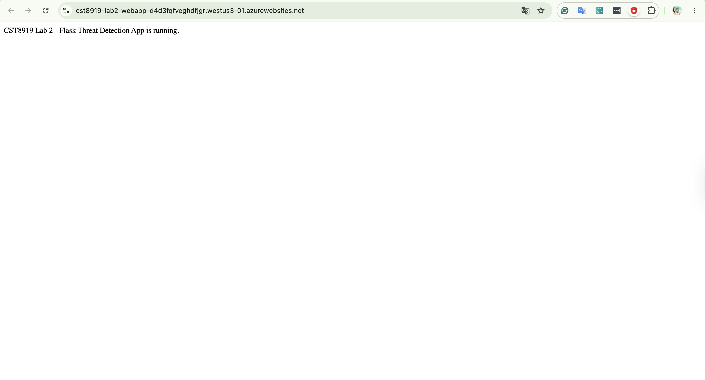
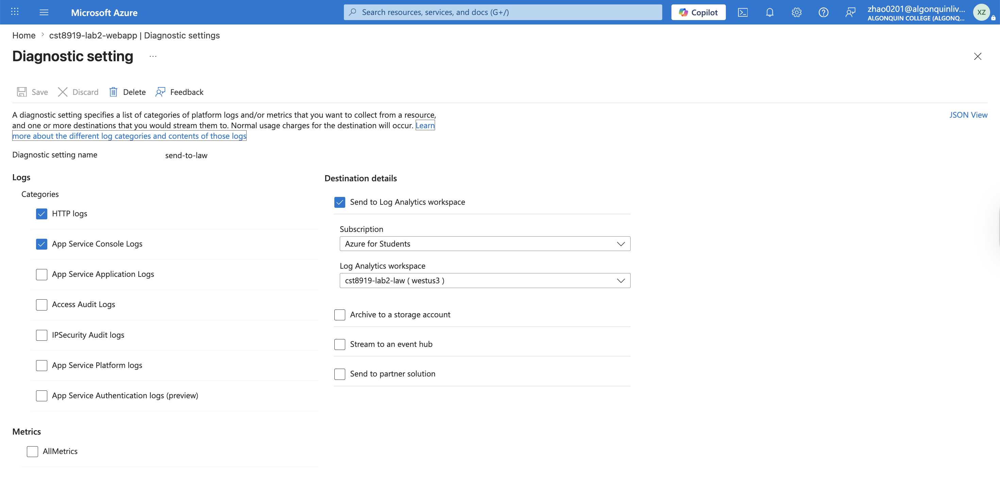
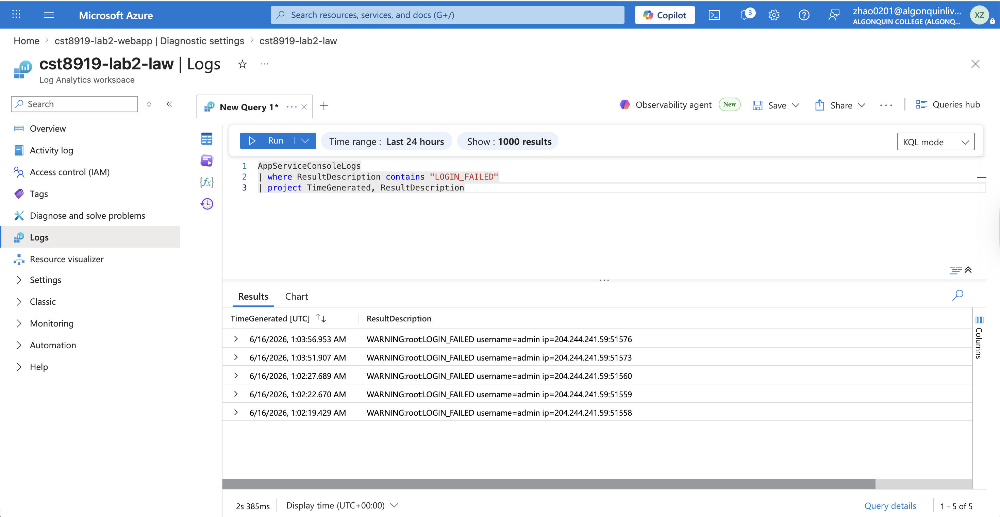
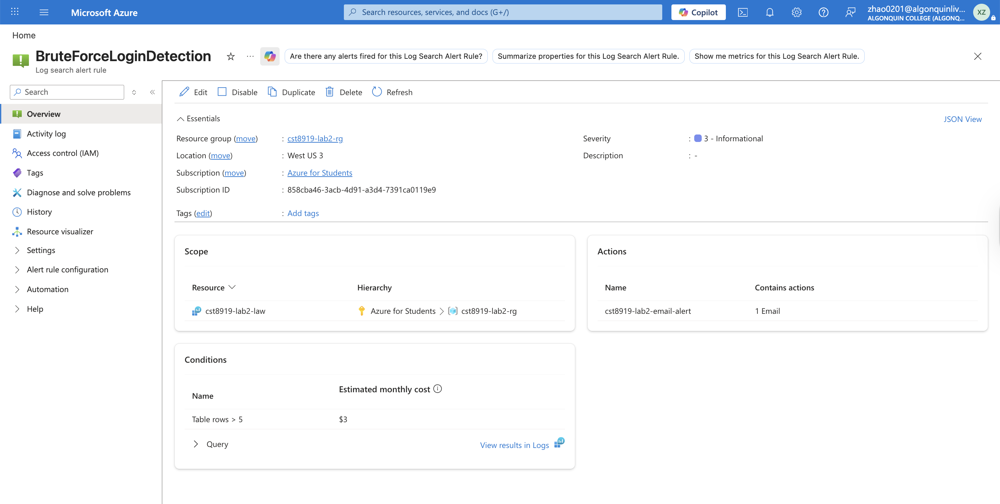
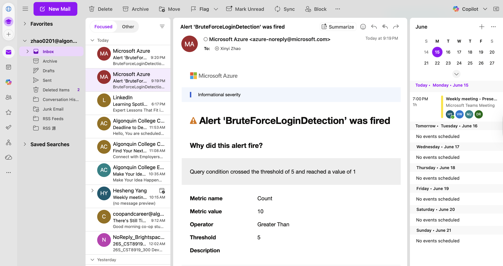

# CST8919 Lab 2: Building a Web App with Threat Detection using Azure Monitor and KQL

#### Student Information

**Name:** Xinyi Zhao  
**Student Number:** 040953633  
**Course:** CST8919 - DevOps: Secuirty and Compliance  
**Lab:** Lab 2 – Building a Web App with Threat Detection using Azure Monitor and KQL

### YouTube Demo

YouTube Demo Video: 
> https://youtu.be/bHonQ8z59Q4

The demonstration includes:

1. Flask application deployment
2. Failed login generation
3. Azure Monitor log collection
4. KQL query execution
5. Alert rule configuration
6. Email notification trigger verification

## Overview

In this lab, I developed a Python Flask web application and deployed it to Azure App Service. The application records successful and failed login attempts. Azure Monitor and Log Analytics Workspace were configured to collect application logs. Kusto Query Language (KQL) was then used to identify failed login attempts, and an Azure Monitor Alert Rule was created to detect potential brute-force login activity. When the number of failed login attempts exceeded the configured threshold, an email notification was automatically sent using an Azure Monitor Action Group.

---

### Part 1 – Deploy the Flask Application

A Flask application was created with a /login endpoint that validates user credentials and records both successful and failed login attempts.



---

### Part 2 – Enable Monitoring

A Log Analytics Workspace was created and connected to the Azure Web App using Diagnostic Settings.

The following log categories were enabled:

* App Service Console Logs
* HTTP Logs

Logs were configured to be sent to the Log Analytics Workspace for analysis.



---

### Part 3 – Query Logs with KQL

After generating multiple failed login attempts, KQL was used to search the collected logs.

#### KQL Query
```kql
AppServiceConsoleLogs
| where ResultDescription contains "LOGIN_FAILED"
| project TimeGenerated, ResultDescription
```
#### Query Explanation

This query searches the App Service Console Logs table and returns all records containing the string LOGIN_FAILED. It helps identify failed login attempts and can be used to detect potential brute-force attacks.



---

### Part 4 – Create an Alert Rule

An Azure Monitor Alert Rule was created using the KQL query.

#### Alert Configuration

* Scope: Log Analytics Workspace
* Measure: Table rows
* Aggregation Type: Count
* Aggregation Granularity: 5 minutes
* Threshold: Greater than 5
* Evaluation Frequency: 1 minute
* Severity: 3 (Informational)

An Action Group was configured to send email notifications when the alert is triggered.



---

### Alert Trigger Verification

Multiple failed login attempts were generated to trigger the alert rule.

When the threshold was exceeded, Azure Monitor successfully detected the activity and automatically sent an email notification.



---

### What I Learned

During this lab, I learned how to:

* Deploy a Python Flask application to Azure App Service.
* Configure Azure Monitor Diagnostic Settings.
* Send application logs to a Log Analytics Workspace.
* Use Kusto Query Language (KQL) to analyze application logs.
* Create Azure Monitor Alert Rules.
* Configure Action Groups for automated email notifications.
* Detect suspicious login behavior using cloud monitoring services.

---

### Challenges Faced

One challenge was ensuring that application logs were properly sent to the Log Analytics Workspace. It took several minutes for logs to appear after Diagnostic Settings were configured.

Another challenge was determining the correct KQL query and identifying the appropriate log table and field that contained the failed login information.

Configuring and testing the alert rule also required generating enough failed login attempts to exceed the configured threshold.

---

### Real-World Improvements

In a production environment, the detection logic could be improved by:

* Tracking failed login attempts by IP address.
* Detecting repeated attacks against specific user accounts.
* Implementing account lockout policies after multiple failed attempts.
* Adding Multi-Factor Authentication (MFA).
* Integrating Azure Sentinel / Microsoft Sentinel for advanced threat detection.
* Creating dashboards and security reports for continuous monitoring.

---
